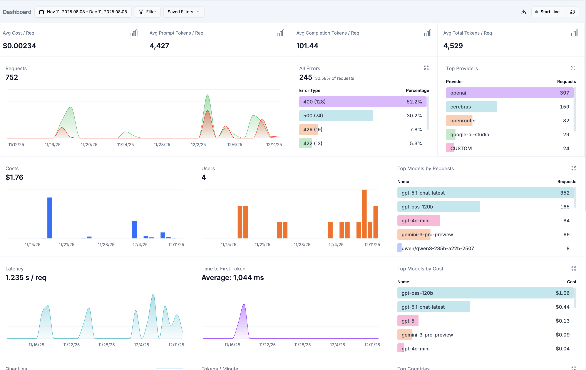
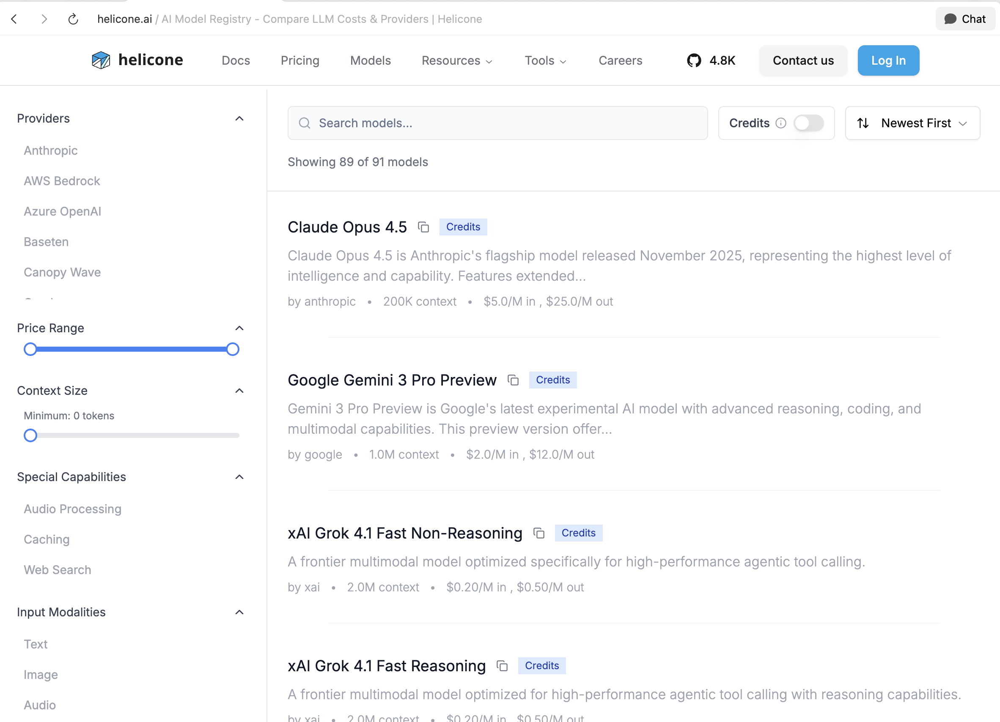
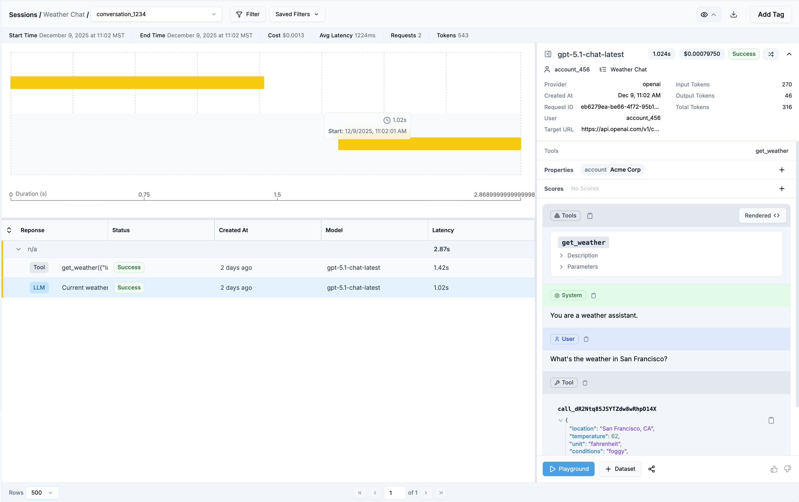

# Helicone Ruby Client

A Ruby client for the [Helicone AI Gateway](https://helicone.ai), wrapping the OpenAI API with built-in session tracking, cost attribution, and an agentic framework for building AI applications with tool/function calling.

## Why Helicone?

[Helicone](https://helicone.ai) is an AI gateway that sits between your application and LLM providers (OpenAI, Anthropic, etc.). It provides:

- **Unified billing** - One API key, one bill, access to multiple providers
- **Request logging** - Every API call is logged with full request/response details
- **Cost tracking** - See exactly what you're spending per user, session, or feature
- **Latency monitoring** - Track response times and identify slow requests
- **Rate limiting & caching** - Built-in protection and optimization



*The Helicone dashboard shows all your LLM requests with latency, cost, and token usage at a glance.*

## Installation

Add this line to your application's Gemfile:

```ruby
gem 'helicone-rb'
```

And then execute:

```bash
bundle install
```

Or install it yourself as:

```bash
gem install helicone-rb
```

## Configuration

First, [sign up for a Helicone account](https://us.helicone.ai/signup) to get your API key.

Set the `HELICONE_API_KEY` environment variable:

```bash
export HELICONE_API_KEY=sk-helicone-your-key-here
```

That's it! The gem reads from `ENV["HELICONE_API_KEY"]` automatically.

Helicone handles billing and routes requests to OpenAI or other providers. See the [model registry](https://www.helicone.ai/models) for supported models including GPT-4, Claude, Llama, and more.



*Browse all available models with pricing, context windows, and capabilities in the Helicone model registry.*

### Optional Configuration

You can optionally configure the default model and logger:

```ruby
Helicone.configure do |config|
  config.default_model = "gpt-4o"             # default
  config.logger = Logger.new($stdout)         # default
end
```

## Basic Usage

### Simple Chat

```ruby
client = Helicone::Client.new

# Single-turn conversation
response = client.ask("What is the capital of France?")
# => "The capital of France is Paris."

# With system prompt
response = client.ask(
  "Explain quantum computing",
  system: "You are a physics teacher. Explain concepts simply."
)
```

### Multi-turn Conversations

```ruby
client = Helicone::Client.new

messages = [
  Helicone::Message.system("You are a helpful assistant."),
  Helicone::Message.user_text("My name is Alice."),
]

response = client.chat(messages: messages)
puts response.content
# => "Nice to meet you, Alice!"

# Continue the conversation
messages << response.to_message
messages << Helicone::Message.user_text("What's my name?")

response = client.chat(messages: messages)
puts response.content
# => "Your name is Alice."
```

### Vision (Images)

```ruby
client = Helicone::Client.new

# Single image
response = client.ask_with_image(
  "What's in this image?",
  "https://example.com/image.jpg"
)

# Multiple images
message = Helicone::Message.user_with_images(
  "Compare these two images",
  ["https://example.com/a.jpg", "https://example.com/b.jpg"],
  detail: "high"
)
response = client.chat(messages: [message])
```

## Session and Account Tracking

Track conversations and attribute costs to specific users or accounts in the Helicone dashboard:

```ruby
client = Helicone::Client.new(
  session_id: conversation.id,
  session_name: "Support Chat ##{conversation.id}",
  account_id: user.account_id,
  account_name: user.account.name
)
```

Sessions group related requests together, letting you see the full flow of a conversation or agentic workflow:



*The session view shows each request in a conversation as a flamegraph, with timing and token usage for each step. Great for debugging agent loops and understanding where time and tokens are spent.*

## Agentic Framework

Build AI agents that can use tools to accomplish tasks.

### Defining Tools

Tools use JSON Schema for parameter definitions. The schema is passed through to the underlying [ruby-openai](https://github.com/alexrudall/ruby-openai) gem, so any schema format that OpenAI's function calling API accepts will work:

```ruby
class WeatherTool < Helicone::Tool
  description "Get current weather for a location"

  parameters(
    type: "object",
    properties: {
      location: {
        type: "string",
        description: "City and state, e.g. 'San Francisco, CA'"
      },
      unit: {
        type: "string",
        enum: ["celsius", "fahrenheit"],
        description: "Temperature unit"
      }
    },
    required: ["location"]
  )

  def execute(location:, unit: "fahrenheit")
    # Your implementation here
    weather_api.get(location, unit: unit)
  end
end
```

Complex nested schemas are supported:

```ruby
class CreateOrderTool < Helicone::Tool
  description "Create a new order"

  parameters(
    type: "object",
    properties: {
      customer: {
        type: "object",
        properties: {
          name: { type: "string" },
          email: { type: "string", format: "email" }
        },
        required: ["name", "email"]
      },
      items: {
        type: "array",
        items: {
          type: "object",
          properties: {
            product_id: { type: "string" },
            quantity: { type: "integer", minimum: 1 }
          },
          required: ["product_id", "quantity"]
        }
      }
    },
    required: ["customer", "items"]
  )

  def execute(customer:, items:)
    Order.create!(customer: customer, items: items)
  end
end
```

### Running an Agent

```ruby
agent = Helicone::Agent.new(
  tools: [WeatherTool, CalendarTool],
  system: "You are a helpful assistant with access to weather and calendar tools.",
  context: current_user  # Passed to tool#initialize
)

result = agent.run("What's the weather in Tokyo and do I have any meetings today?")

puts result.content          # Final response text
puts result.iterations       # Number of tool execution loops
puts result.tool_calls_made  # Total tool calls executed
puts result.success?         # Whether it completed successfully
```

### Continuing Conversations

```ruby
agent = Helicone::Agent.new(tools: [WeatherTool])

result = agent.run("What's the weather in Paris?")
puts result.content

# Continue with follow-up
result = agent.continue("What about London?")
puts result.content
```

## Message Types

```ruby
# Text messages
Helicone::Message.user_text("Hello")
Helicone::Message.assistant_text("Hi there!")
Helicone::Message.system("You are helpful")

# Images
Helicone::Message.user_image("https://example.com/img.jpg", text: "Describe this")
Helicone::Message.user_with_images("Compare", ["url1", "url2"])

# Tool results (internal use)
Helicone::Message.tool_result(tool_call_id: "call_123", content: { data: "result" })
```

## Response Object

```ruby
response = client.chat(messages: messages)

response.content         # Text content
response.role           # "assistant"
response.finish_reason  # "stop", "length", "tool_calls"
response.tool_calls     # Array of tool calls if any
response.model          # Model used
response.usage          # Token usage stats
response.prompt_tokens
response.completion_tokens
response.total_tokens
response.success?       # Quick success check
```

## Development

After checking out the repo, run `bin/setup` to install dependencies. Then, run `rake spec` to run the tests.

```bash
bundle install
bundle exec rspec
```

### Live Integration Tests

To run tests against the actual Helicone API:

```bash
HELICONE_LIVE_TEST=true HELICONE_API_KEY=your_key bundle exec rspec spec/helicone/integration_spec.rb
```

## Contributing

Bug reports and pull requests are welcome on GitHub at https://github.com/genevere-inc/helicone-rb.

## License

The gem is available as open source under the terms of the [MIT License](https://opensource.org/licenses/MIT).
